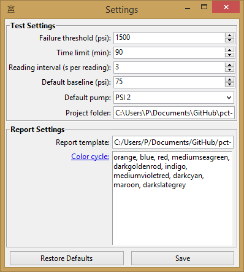
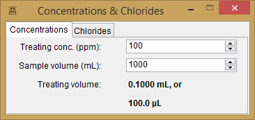
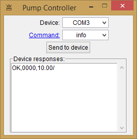

<!-- <p  align='center'>

</p> -->


# ScaleWiz
A graphical user interface designed to work with Teledyne SSI MX-class pumps.
The intended usage is for running dynamic tube-blocking tests for calcium
carbonate scale inhibitor chemical performance testing.
Features include:
* real-time data visualization
* simple, reliable workflow for setting up projects and handling data output to .csv files
* no hardware hassle - COM ports are automatically detected and managed
* straightforward test controls and experiment parameter settings
* plotting utility for producing publication-quality images, with support for exporting test results to a .xlsx file
* a simple calculator for determining chemical injection volume

## Installation
Dependencies may be installed using the requirements.txt file included.
```bash
python3 -m pip install -r requirements.txt
```

Then download the source code and run core.py
```bash
python3 core.py
```

### Alternatives
Hardware drivers and a limited pump interface may be downloaded from the [manufacturer website](https://ssihplc.com/manuals/#driver-downloads).

## Screenshots
### Main window

### Plotting utility

### Sample plot

### Settings menu

### Concentration calculator

### Stand-alone pump interface



## License
[MIT License](https://choosealicense.com/licenses/mit/)

Copyright (c) 2020 Premier Chemical Technologies, LLC

Permission is hereby granted, free of charge, to any person obtaining a copy of this software and associated documentation files (the "Software"), to deal in the Software without restriction, including without limitation the rights to use, copy, modify, merge, publish, distribute, sublicense, and/or sell copies of the Software, and to permit persons to whom the Software is furnished to do so, subject to the following conditions:

The above copyright notice and this permission notice shall be included in all copies or substantial portions of the Software.

THE SOFTWARE IS PROVIDED "AS IS", WITHOUT WARRANTY OF ANY KIND, EXPRESS OR IMPLIED, INCLUDING BUT NOT LIMITED TO THE WARRANTIES OF MERCHANTABILITY, FITNESS FOR A PARTICULAR PURPOSE AND NONINFRINGEMENT. IN NO EVENT SHALL THE AUTHORS OR COPYRIGHT HOLDERS BE LIABLE FOR ANY CLAIM, DAMAGES OR OTHER LIABILITY, WHETHER IN AN ACTION OF CONTRACT, TORT OR OTHERWISE, ARISING FROM, OUT OF OR IN CONNECTION WITH THE SOFTWARE OR THE USE OR OTHER DEALINGS IN THE SOFTWARE.
