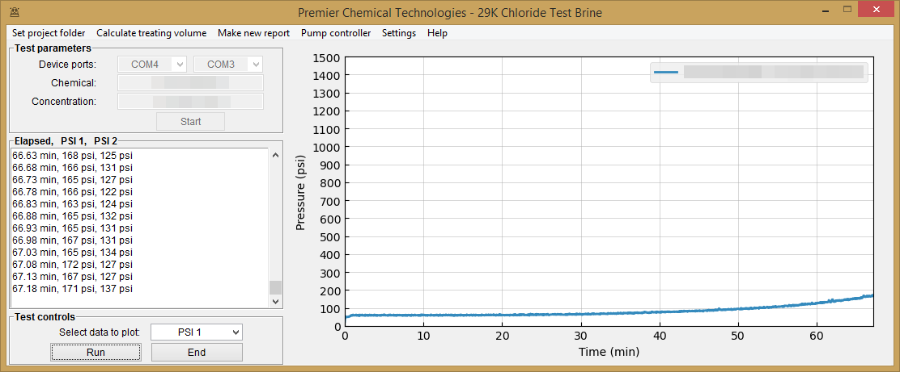
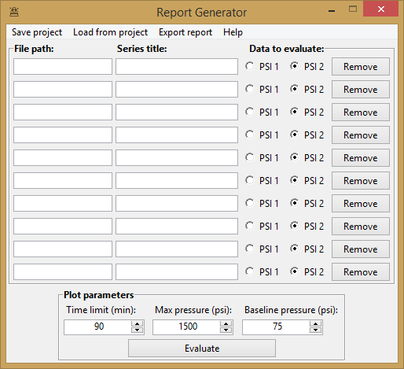

# Premier Chemical Technologies, LLC  - Scale Block Wizard
A graphical user interface designed to work with Teledyne SSI MX-class pumps.
The intended usage is for running dynamic tube-blocking tests for calcium
carbonate scale inhibitor chemical performance testing.
Features include:
  * simple, reliable workflow for setting up experiments and
   handling data output
  * straightforward pump controls
  * real-time pressure data visualization with multiple style options
  * easy to use plotting utility for producing publication-quality images

## Installation
Download the source code and run core.py.
```bash
python core.py
```
One-file bundle (.exe) incoming ...

### Requirements
The appropriate hardware drivers may be downloaded from the
 [manufacturer website](https://ssihplc.com/manuals/#driver-downloads).

Should run off of most Anaconda installations.
The application imports from pandas, serial, winsound, and matplotlib, plus a
few standard library modules.
Requirements.txt incoming ...

## Screenshots
### Main window

### Plotting utility


## Roadmap
Basic Matplotlib styles support for the plotting utility is the most recently
added feature.
Planned features include
  * greater customization options for the plotting utility
   (eg. defining figure size)
  * simple utility to read/write generic messages to/from the pumps
  * configuration file support to remember useful information
    such as last used project directory, plot style templates, etc.

## Contributing
Pull requests are welcome. For major changes, please open an issue first to discuss what you would like to change.


## License
[MIT License](https://choosealicense.com/licenses/mit/)

Copyright (c) 2020 Premier Chemical Technologies, LLC

Permission is hereby granted, free of charge, to any person obtaining a copy of this software and associated documentation files (the "Software"), to deal in the Software without restriction, including without limitation the rights to use, copy, modify, merge, publish, distribute, sublicense, and/or sell copies of the Software, and to permit persons to whom the Software is furnished to do so, subject to the following conditions:

The above copyright notice and this permission notice shall be included in all copies or substantial portions of the Software.

THE SOFTWARE IS PROVIDED "AS IS", WITHOUT WARRANTY OF ANY KIND, EXPRESS OR IMPLIED, INCLUDING BUT NOT LIMITED TO THE WARRANTIES OF MERCHANTABILITY, FITNESS FOR A PARTICULAR PURPOSE AND NONINFRINGEMENT. IN NO EVENT SHALL THE AUTHORS OR COPYRIGHT HOLDERS BE LIABLE FOR ANY CLAIM, DAMAGES OR OTHER LIABILITY, WHETHER IN AN ACTION OF CONTRACT, TORT OR OTHERWISE, ARISING FROM, OUT OF OR IN CONNECTION WITH THE SOFTWARE OR THE USE OR OTHER DEALINGS IN THE SOFTWARE.
